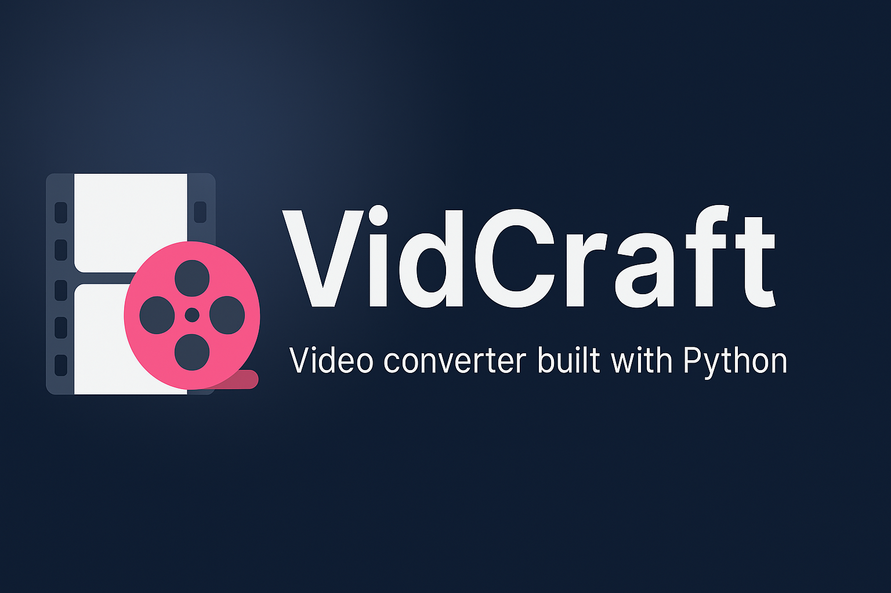
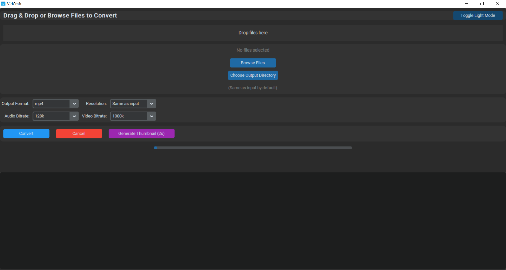
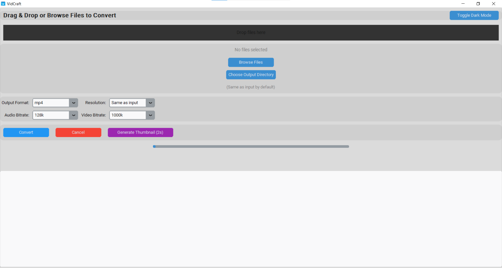

# 

🎞️ **VidCraft** – A sleek, modern, and powerful **Video Converter** built with **Python**, **CustomTkinter**, and **FFmpeg**.

---

## 🚀 Features

- ✅ Drag & Drop support (via TkinterDnD)
- 📼 Multiple output formats: `mp4`, `avi`, `mkv`, `mov`, `mp3`, `wav`, `aac`, `gif`, `flv`, `webm`
- 🎯 Resolution & Bitrate control
- 📁 Choose custom output directory
- 🖼️ Thumbnail generation at 2-second mark
- 🌓 Dark & Light theme toggle
- 💬 Real-time console log
- 🪄 Simple, beautiful CustomTkinter UI

---

## 📸 Preview

### 🌑 Dark Mode


### ☀️ Light Mode


---

## 🛠 Built With

| Tech Stack     | Description |
|----------------|-------------|
|  | Programming language |
|  | UI toolkit |
|  | Modern theming for Tkinter |
|  | Multimedia framework |
|  | Image processing |
|  | For building EXE |

---

## 📦 Installation

1. Clone this repository:

```bash
git clone https://github.com/wwmanidumaneesha/vidcraft.git
cd vidcraft
```

2. Install dependencies:

```bash
pip install -r requirements.txt
```

3. Run the app:

```bash
python video_converter.py
```

Make sure `ffmpeg.exe` and `ffprobe.exe` are in the project root.

---

## 🧊 Build EXE (Optional)

You can bundle the app into a Windows `.exe`:

```bash
pyinstaller --noconfirm --icon=icon.ico video_converter.py
```

> Ensure `icon.ico` exists and `PyInstaller` is installed.

---

## 📝 License

Licensed under the **MIT License**.  
Feel free to use, modify, and distribute VidCraft.

---

## 🙌 Author

Made with ❤️ by [Manidu Maneesha](https://github.com/wwmanidumaneesha)

Follow me for more cool projects!